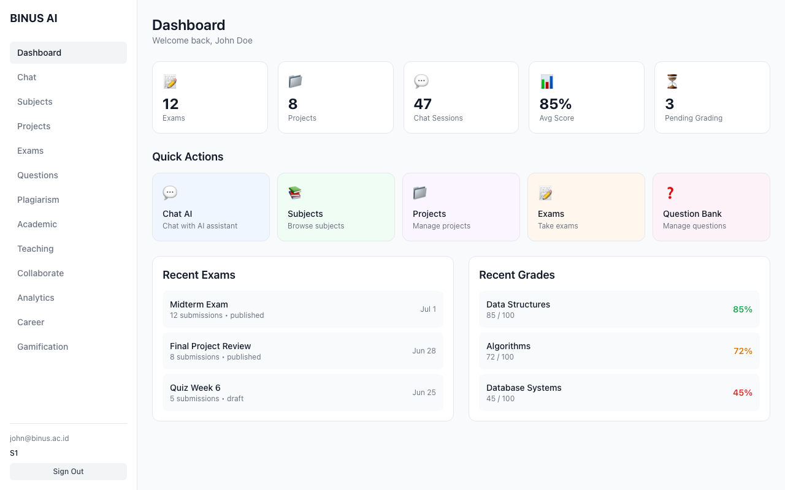
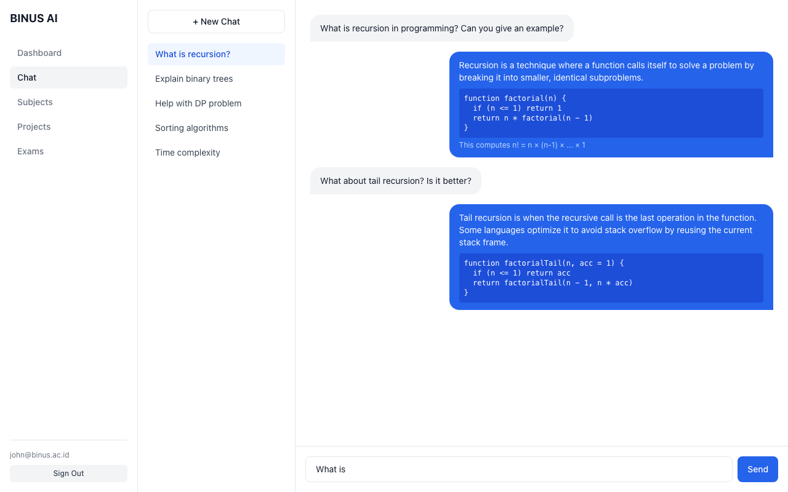
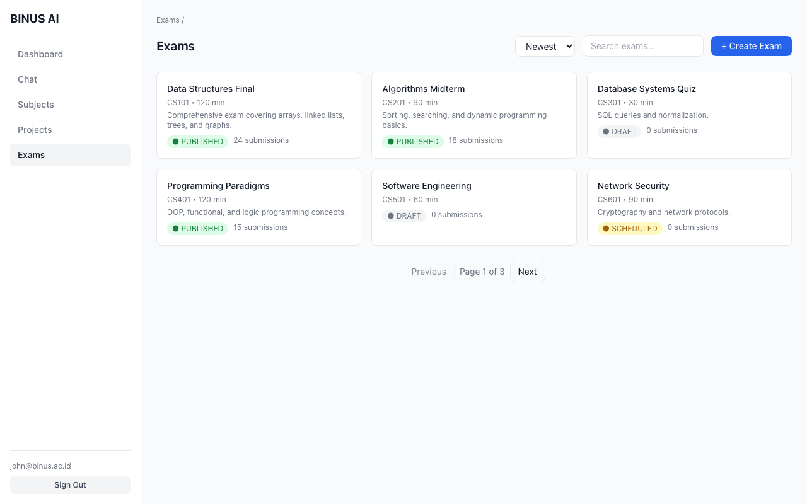
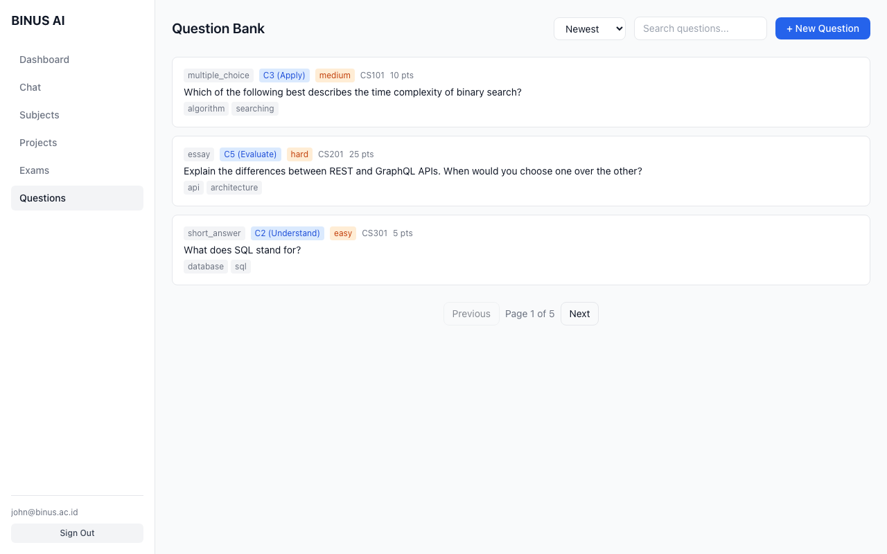
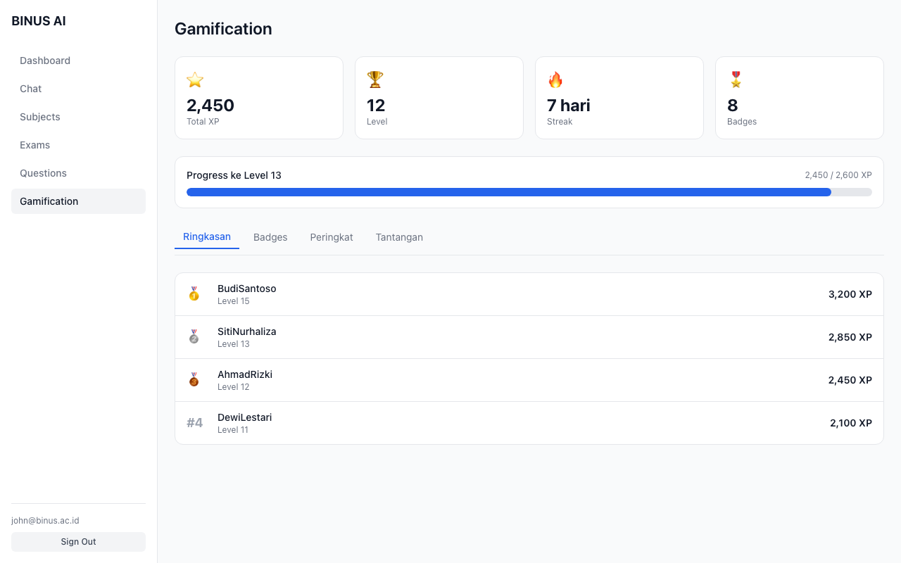

# BINUS AI — Adaptive Learning Platform

AI-powered adaptive learning platform for K-12 to university students, built with Next.js 16.

## Sneak Peek

| Dashboard | Chat AI |
|-----------|---------|
|  |  |

| Exams | Question Bank |
|-------|---------------|
|  |  |

| Gamification |
|--------------|
|  |

## Features

- **Dashboard** — Overview stats, quick actions, recent exams & grades
- **Chat AI** — Conversational AI assistant for subject help and explanations
- **Subjects** — Browse courses and knowledge base
- **Projects** — Upload files, plagiarism checking
- **Exams** — Create, take, and grade exams with various question types
- **Question Bank** — Manage questions with Bloom's taxonomy levels
- **Plagiarism Check** — Document similarity analysis
- **Academic Writing** — Literature review, citation, outline tools
- **Teaching Tools** — RPS generator, learning path
- **Collaboration** — Study groups & discussion forums
- **Analytics** — Grade distribution & knowledge gap analysis
- **Career** — Career path recommendations
- **Gamification** — XP, levels, streaks, badges, leaderboard

## Tech Stack

- **Framework:** Next.js 16 (App Router)
- **UI:** Tailwind CSS v4, shadcn/ui, @base-ui/react
- **Auth:** NextAuth.js (Credentials + Microsoft Entra ID SSO)
- **Database:** Prisma ORM
- **AI:** Azure OpenAI / OpenAI / Anthropic / Ollama (pluggable)
- **Icons:** lucide-react
- **Notifications:** sonner

## Getting Started

```bash
npm install
npm run dev
```

Open [http://localhost:3000](http://localhost:3000).
